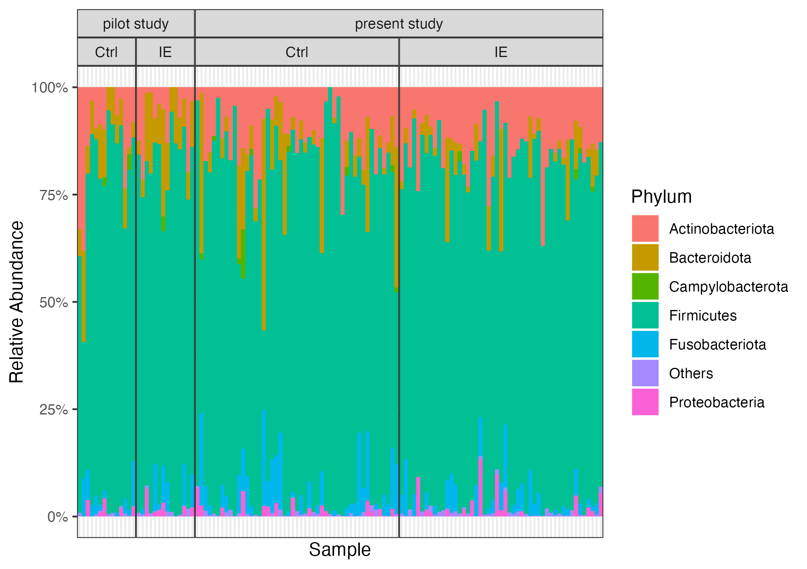

# Reproducible analyses for *Gut microbiome alterations in canine idiopathic epilepsy: a pairwise case-control study*

This repository contains the reproducible analysis workflow and figures for:

> Yang, Y., Nettifee, J., Azcarate-Peril, M. A., Muñana, K. R., & Callahan, B. J. (2026). [Gut microbiome alterations in canine idiopathic epilepsy: a pairwise case-control study](https://doi.org/10.1186/s42523-026-00594-1). *Animal Microbiome*.

We profiled the fecal microbiomes of 98 dogs (49 with idiopathic epilepsy and 49 matched controls) using 16S rRNA gene sequencing. The study uses a pairwise case-control design in which each epileptic dog is paired with a control dog from the same household.

The analysis identified a modest but significant difference in gut microbial community composition between groups and a *Collinsella* ASV consistently enriched in dogs with idiopathic epilepsy.

## Repository contents

- `code/` contains the R Markdown source files and their rendered HTML reports.
- `data/following_study/` contains the processed study data, metadata, and intermediate `phyloseq` objects used by the analyses.
- `data/pilot_study/` contains processed data from the earlier pilot study.
- `figures/` contains the manuscript figures.

Raw sequencing reads are not included. The stored intermediate data objects are sufficient to reproduce the analyses after sequence preprocessing.

## Rendered analyses

The R Markdown reports can be viewed directly in a browser:

- [16S rRNA sequence preprocessing with DADA2](https://yixuan39.github.io/CanineEpilepsy2/code/DADA2-preprocess.html)
- [Metadata cleaning and data storage](https://yixuan39.github.io/CanineEpilepsy2/code/data-cleaning.html)
- [Study data profile and taxonomic composition](https://yixuan39.github.io/CanineEpilepsy2/code/data-profile.html)
- [Alpha and beta diversity analysis](https://yixuan39.github.io/CanineEpilepsy2/code/alpha-beta-diversity.html)
- [Differential abundance analysis](https://yixuan39.github.io/CanineEpilepsy2/code/DA-analysis.html)
- [ASV sharing within and between households](https://yixuan39.github.io/CanineEpilepsy2/code/ASV-sharing.html)
- [Analysis of *Collinsella* and *Lactobacillus*](https://yixuan39.github.io/CanineEpilepsy2/code/top-candidate.html)
- [Idiopathic epilepsy prediction from fecal microbiome composition](https://yixuan39.github.io/CanineEpilepsy2/code/epilepsy-prediction.html)

## Reproducing the analyses

Clone the repository, install the R packages loaded by the report you wish to run, and render its `.Rmd` file. Analyses that begin with the processed data can be reproduced using the included `phyloseq` objects; preprocessing from raw reads additionally requires access to the sequencing data.

## Questions

Please use the [Issues tracker](https://github.com/Yixuan39/CanineEpilepsy2/issues) for questions or comments.

